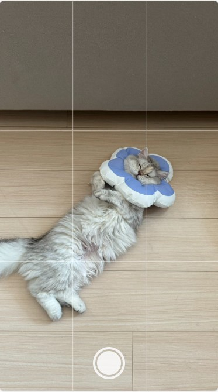

# Vue3 Camera



## Introduction

**vue3-camera** is a simple Vue 3 component designed to integrate webcam functionality into Vue applications.
Easily capture images from the user's webcam with minimal configuration.

## Features

- **Easy Integration**: Seamlessly integrate webcam functionality into your Vue 3 projects.
- **Capture Images**: Capture images from the user's webcam.
- **Customizable**: Customize the component to fit your application's styling and requirements.

## Installation

```bash
npm install vue3-camera
```

## Usage

1. Import the `Vue3Camera` component into your Vue file.

    ```ts
    <script setup lang="ts">
    import Camera from "vue3-camera"
    </script>
    ```

2. Use the `Vue3Camera` component in your template.

    ```html
    <template>
        <Camera @on-snapshot="onSnapshot" facing-mode="environment" :grid-line="true" />
    </template>
    ```

3. Handle the event for image capture in your methods.

    ```ts
    const onSnapshot = (base64: string) => {
        console.log(base64)
    }
    ```

## Props

- **facing-mode**: "environment" | "user" (default: "environment").
- **grid-line**: boolean.

## Events

- **on-snapshot**: Triggered when an image is captured. Returns the captured image data.

```html
<Camera @on-snapshot="onSnapshot"/>
```

## License

This project is licensed under the MIT License - see the [LICENSE.md](LICENSE.md) file for details.

## Contribution

Contributions are welcome! Please open an issue or submit a pull request.
